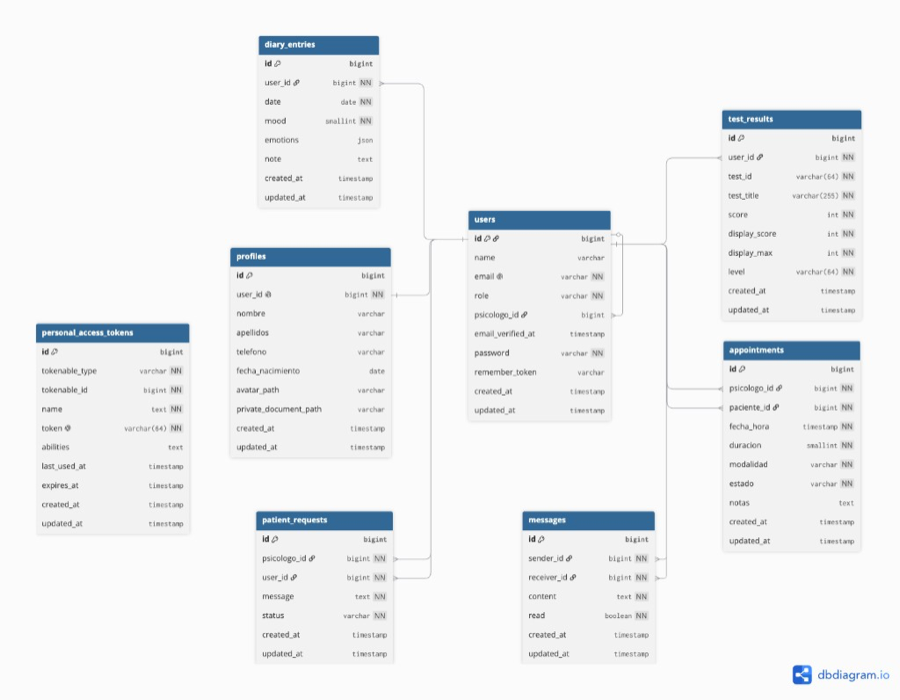

# **Paloma Ocaña** y **Martín Bernal González** · 2º DAW Mañana

## Senti2

Senti2 es una plataforma web de bienestar emocional que conecta pacientes con psicólogos. Los usuarios pueden realizar tests de autoevaluación, llevar un diario emocional, solicitar seguimiento, reservar citas y chatear con su psicólogo asignado. Los psicólogos gestionan pacientes, citas y mensajes desde un panel propio. Los administradores disponen de un panel de gestión de usuarios y contenido del sistema.

---

## Objetivos

- Ofrecer herramientas de seguimiento emocional accesibles (tests, diario y perfil).
- Facilitar la relación paciente–psicólogo: solicitudes, citas y chat en tiempo real.
- Implementar roles diferenciados (`user`, `psicologo`, `admin`) con permisos y vistas propias.
- Desarrollar una landing page estática (DIW) independiente de la SPA.
- Desplegar la aplicación en producción con Docker, CI/CD y base de datos en la nube.

---

## Enlaces

| | |
|--|--|
| App | https://senti2.duckdns.org |
| Landing (DIW) | https://senti2.duckdns.org/landing/ |
| Admin | https://senti2.duckdns.org/panel-admin/login |
| API | https://senti2.duckdns.org/docs/api |
| Repo | https://github.com/Holasoymartin25/Senti2 |
| Bitácora (Jira) | https://martinhuawei25-1760085767571.atlassian.net/jira/software/projects/SCRUM/boards/1/backlog |
| Vídeo | https://youtu.be/iiZ3IyO55n0 |
| UI Kit | https://www.figma.com/design/DEruwgHUcU4dyW1NMLYmQF/Proyecto-Senti2-UiKit |
| FigJam | https://www.figma.com/board/l3mHfWrikJh4IhvWt1w6Yr/FigJam_Senti2 |
| PDF presentación |  |

_Pendiente: PDF · Notion (anteproyecto) · capturas en `docs/capturas/`_
---

## Stack

| Capa | Tecnología |
|------|------------|
| Frontend (SPA) | Angular 19, TypeScript |
| Backend (API) | Laravel 12, Sanctum, Scramble (docs API) |
| Tiempo real | Laravel Reverb (WebSockets) |
| Panel admin | Laravel Blade + Tailwind |
| Landing (DIW) | HTML5, SCSS (BEM), JavaScript |
| Base de datos | PostgreSQL (Neon) |
| Infra | Docker, Nginx, Caddy, GitHub Actions, AWS, DuckDNS |

**Roles:** `user` (paciente), `psicologo`, `admin`.

**Reparto de tareas:** 
Martín — frontend Angular, landing DIW, chat.
Paloma — backend Laravel, base de datos, despliegue.

---

## Base de datos

Esquema entidad–relación (PostgreSQL):

---

## Cómo probar

- **Paciente:** `usuario1@admin.com` / `password` → tests, diario, chat
- **Psicólogo:** `/admin` → `psicologo1@admin.com` / `password`
- **Admin:** `/panel-admin/login` → `admin1@admin.com` / `password` (también accesible desde login Angular si el rol es admin)
- **Landing local:** desde `Senti2/` → `npm run landing` (puerto 5500)
- **Landing producción:** `/landing/`

---

## Bitácora

Registro de tareas en **Jira**: [tablero SCRUM](https://martinhuawei25-1760085767571.atlassian.net/jira/software/projects/SCRUM/boards/1/backlog).

## Bibliografía

- [Angular — Documentación oficial](https://angular.dev)
- [Laravel 12 — Documentación oficial](https://laravel.com/docs/12.x)
- [Laravel Sanctum — Autenticación API](https://laravel.com/docs/12.x/sanctum)
- [Laravel Reverb — WebSockets](https://laravel.com/docs/12.x/reverb)
- [PostgreSQL — Documentación](https://www.postgresql.org/docs/)
- [TypeScript — Handbook](https://www.typescriptlang.org/docs/)
- [Docker — Documentación](https://docs.docker.com/)
- [Sass — Guía oficial](https://sass-lang.com/documentation/)
- [Figma — Help Center](https://help.figma.com/)
- [MDN Web Docs — HTML, CSS y JavaScript](https://developer.mozilla.org/es/)
- [Neon — Serverless Postgres](https://neon.tech/docs/introduction)
